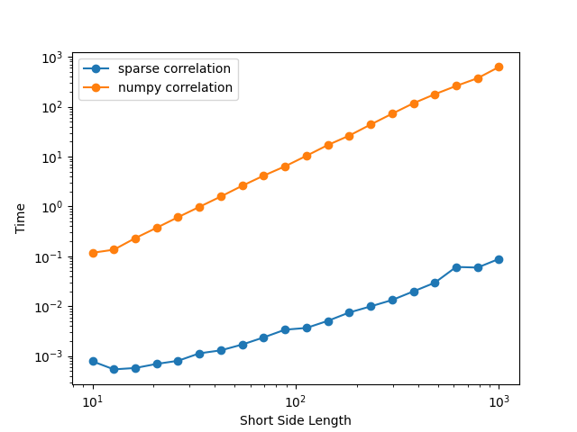
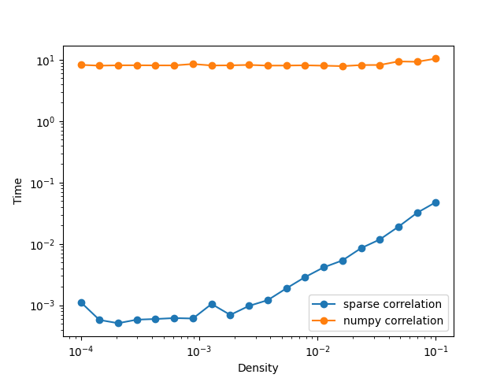

# sparse_matrix

We provide a paradigm for conducting pairwise row operations (e.g., Pearson correlation) for large sparse matrices. The classical `np.corrcoef()` function does not support the `csr_matrix` datatype, and transforming back to a dense matrix can be time-consuming or infeasible due to RAM limitations for large data. Our approach addresses this problem effectively. Users may also consider `dask` as a parallel computing add-on and alternative. We also provide an external datafile `microns_allW.npz` (90300*90300, density~0.001) for test purpose. 

